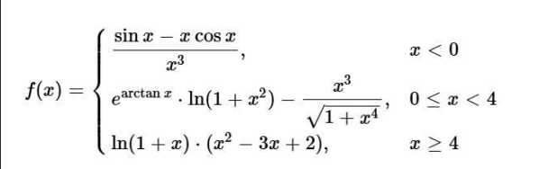

# Курсовая работа
Цель данной работы - алгоритмизация и написание кода на языке СИ для табулирования кусочной функции f(x), 
использующую многоальтернативный выбор решения:

## Задачи, которые необходимо решить в данной работе:
Создать интерфейс программы, который должен обеспечивать выполнение операций:
 - Значение – f(x) в точке;
 - Таблица – x → f(x) на интервале;
 - Min/max - экстремумы на отрезке;
 - Поиск x – найти x: f(x) ≈ Y;
 - Производная - f’(x) в точке;

## 📁 Структура проекта

├── README.md

├── Source.c

├── func.png

├── 1func.png

├── 2func.png

├── 3func.png

├── 4func.png

├── 5func.png

## 🔧 Реализованные функции и структуры

